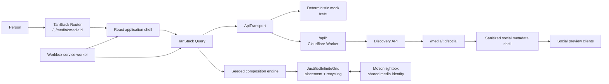
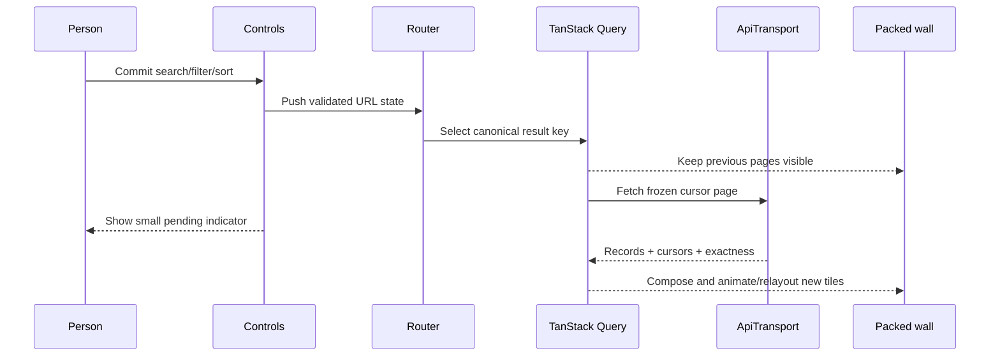

# X Inspo System Architecture

This is the canonical implementation map for the greenfield X Inspo
frontend. Read `CONTEXT.md` first for the domain vocabulary. The retired
bookmark-browser runtime has been deleted; the catalog pipeline remains as an
operator-facing data producer and is not an architectural input to the UI.

## System at a Glance



The browser owns interaction state, projection, and visual composition. The
API owns searchable records and stable cursor snapshots. The Worker owns the
same-origin API boundary, static delivery, and route-specific social HTML.

## Runtime Composition

`src/main.tsx` is the only active browser entry point. It creates one query
client and one router, injects the `ApiTransport`, mounts the shadcn tooltip
provider, and registers the service worker in production.

The browser TypeScript project includes all of `src/`: `src/main.tsx`,
`src/greenfield/`, the used shadcn primitives under `src/components/ui/`, and
`src/lib/utils.ts`. There are no ignored legacy frontend directories; all
remaining source is part of the active typecheck and lint surface.

The UI stack is:

- React 19 and TypeScript, built by Vite.
- Tailwind CSS with theme tokens in `src/index.css`.
- shadcn/ui primitives in `src/components/ui/` for controls, dialogs, drawers,
  popovers, tooltips, and loading states.
- Lucide icons; controls expose text labels or accessible names.
- Motion for layout/shared-element transitions.
- `@use-gesture/react` for lightbox pan, swipe, pinch, and wheel gestures.

The default visual system is dark, neutral, media-first, and uses a restrained
mint accent. Media carries the visual color; surrounding chrome stays quiet.

## Domain and API Boundaries

Hand-authored browser contracts live in `src/greenfield/contracts/`.

| Type | Responsibility |
| --- | --- |
| `MediaRecord` | Searchable record metadata and ordered assets |
| `MediaAsset` | Stable media identity, intrinsic size, and rendition catalogs |
| `CommittedWallState` | Validated shareable query and composition state |
| `DiscoveryPage` | Cursor page from one frozen result set |
| `WallTile` | Client-only justified-wall projection |
| `ApiTransport` | Discovery, count, and direct-media port |
| `CompositionEngine` | Records-to-tiles projection port |
| `PlaybackCoordinator` | Page/surface-aware video lifecycle port |
| `Telemetry` | Sanitized performance and error sink |

`contracts/openapi.yaml` is the production HTTP source of truth. It specifies
discovery pages and counts, suggestions, facets and facet autocomplete, direct
media lookup, per-media social metadata, and discovery configuration.
`bun run api:generate` writes `src/greenfield/generated/api.ts`.

Do not make UI components depend directly on `fetch` or generated transport
details. `src/greenfield/data/http-api.ts` implements production HTTP behind
`ApiTransport`; `src/main.tsx` selects it outside test mode.
`src/greenfield/data/mock-api.ts` supplies a deterministic 96-record fixture
for tests with cursor pagination, search, sort, facets, result relaxation, and
direct media lookup.

## Routing and URL State

TanStack Router defines two routes in `src/greenfield/router/router.tsx`:

- `/` renders the packed discovery wall.
- `/media/$mediaId` renders the same wall with an addressable lightbox over it.

The root owns `GreenfieldApp`; route leaves are intentionally empty so route
changes never unmount the wall. Router scroll restoration remains enabled,
while lightbox overlay navigations explicitly suppress scroll reset so Motion
measures both shared elements in the same viewport coordinate space.

`validateWallSearch` is the only normalization boundary for committed state.
It tolerates malformed external links and always produces renderable defaults.
Canonical search strings use ordinary fields and repeated readable facet
entries, for example:

```text
?q=landscape&filters=kind:image&filters=source:Archive&sort=curated&mode=hybrid&seed=gallery&density=auto
```

The state fields are:

| Field | Meaning | Server result identity? |
| --- | --- | --- |
| `q` | Committed search text | Yes |
| `filters` | Canonical facet selections | Yes |
| `sort` | `curated`, `random`, `newest`, or `oldest` | Yes |
| `similar` | Optional similar-media target | Yes |
| `mode` | `asset`, `record`, or `hybrid` | No |
| `seed` | Deterministic random order and representative/size shuffle | Only for `random` sort |
| `density` | `auto` or numeric tile-size multiplier | No |

This split is reflected in TanStack Query keys. Changing mode or density
recomposes cached records. Changing seed does the same for chronological and
curated sorts, but requests a newly frozen record order for random sort.

### History policy

`src/greenfield/router/history.ts` centralizes navigation behavior:

- Committed search, filters, sort, similar target, shuffle, mode, and density
  push a history entry.
- Mode and density preserve the viewport anchor; result-changing mutations
  land at the top.
- A defensive invalid-density fallback may replace the current entry.
- Opening a wall item pushes `/media/$mediaId`.
- Previous, next, and sibling lightbox navigation replace that media route, so
  they do not flood Back history.
- Closing a lightbox opened from the wall goes Back; a directly opened media
  URL replaces to `/` when closed.

Draft search text, a moving density slider, and uncommitted mobile filters are
local state and never write browser history.

## Discovery Data Flow

TanStack Query owns request cancellation, caching, retry, and infinite cursor
pages. Defaults are a 30-second stale time, 15-minute garbage-collection time,
one retry, and no refetch merely because a tab regains focus.



`keepPreviousData` prevents a blank-wall flash while a changed result set is
loading. The shell sets `aria-busy` and shows pending state near the controls.
Infinite append requests originate in JustifiedInfiniteGrid, are deduplicated by
the wall adapter, and resolve through `fetchNextPage`.

If exact matching returns no records, the API may return the closest results by
relaxing the smallest possible facet set. The UI places an explicit message
above the wall and offers an action that commits those broader filters.

Mobile filter edits remain staged inside a drawer. A separate count query
updates the Apply affordance; only Apply commits filters and creates history.
Desktop filter changes commit directly.

## Composition and the Justified Wall

`src/greenfield/modules/composition/` is a pure deterministic layer between
server records and wall tiles. Given the same records and `CommittedWallState`,
it emits the same tile identities, representatives, scales, and group keys.

Mode behavior:

- `asset`: every asset becomes an independent tile.
- `record`: one representative is chosen from each record's explicitly
  eligible representative IDs.
- `hybrid`: the representative and deterministically ordered siblings share
  one collage tile, capped at four visible assets; the rest become an overflow
  count.

The seed assigns deterministic scale hints for composition stability and
random-sort record order. In the justified wall, visible size variance
comes from intrinsic aspect ratios, composite hybrid ratios, and naturally
varying row heights. Changing the seed also changes representatives; it only
changes the server query when random sort is selected.

### Justified layout ownership

`src/greenfield/modules/wall/MediaWall.tsx` is the single layout adapter. It
uses react-infinitegrid's `JustifiedInfiniteGrid` with recycling, resize
observation, and direct `top`/`left` placement (`useTransform={false}`). Stable
`data-grid-groupkey` values allow independent append groups and reliable
recycling. Detached recycling is not enabled.

An incomplete trailing composition group is buffered while another cursor page
exists, with a compact loading status after the stable wall. This prevents a
single remainder item from temporarily becoming a full-width justified row.
At the terminal page, the remainder joins the preceding group so the grid
balances the final rows once without cropping or stretching.

JustifiedInfiniteGrid alone owns placement, measurement, request-append, and
recycling. TanStack Virtual is intentionally absent. Do not wrap this wall in
another virtual list or add a competing masonry algorithm.

Initial tile dimensions derive from an aspect-aware slice layout. Each slice
row or column contributes its exact composite ratio to JustifiedInfiniteGrid.
Cropping and stretching are disabled. The grid varies row heights to fill
completed rows while preserving every tile ratio, and applies one uniform 4px
inter-tile gap. Wall images,
videos, and lightbox media retain `object-contain` as a defensive guarantee
against crop or distortion. Rows admit at most four tiles below 640px and up to
the 20-tile composition-group size on wider walls, allowing density to remain
effective on ultrawide displays.
Images expose explicit responsive width candidates; videos use posters and
admitted preview sources. The first visible group receives eager image
priority, while the rest use native lazy loading and decoding.
The symmetric InfiniteGrid threshold grows from 600px to 1400px with effective
density, keeping several rows mounted both ahead of and behind the viewport.
Video source admission uses that same offscreen margin.

Tile width and height are known before media decoding. Responsive `<picture>`
subtrees carry `data-grid-skip`, isolating their image readiness from
JustifiedInfiniteGrid's item readiness. Loading or swapping a rendition therefore
does not make the layout engine wait on or separately track nested media; an
explicit repack remains the response to a genuine geometry change.

### Density and stability

`auto` maps viewport classes to a reasonable initial density. The density
control is continuous from 0.6 to 1.75 and maps to the preferred justified row
height. During slider movement, the wall is visually scaled around the viewport
center; release commits one density value and one JustifiedInfiniteGrid reflow.
Before mode, density, or rail-width changes,
the app captures the media nearest the viewport center and restores its screen
position after repacking. This minimizes jumping while preserving genuine
packed placement.

Continuous pinch/trackpad zoom belongs at the gesture layer and must feed the
same draft/commit density path: update the visual scale continuously, then
commit a single reflow at gesture end. Never trigger a full pack on every raw
gesture event.

### Wall accessibility

Each media item is a named button. A roving `tabIndex` keeps one mounted wall
target in the sequential tab order. Arrow keys choose the nearest spatial
neighbor from mounted geometry; Home and End select the first or last mounted
target. Recycling reconciles the active target when DOM nodes change.

## Video Preview Policy

Grid video sources are admitted only when a tile approaches within one
viewport of the visible region. Once admitted, a mounted tile keeps its source
so ordinary visibility changes do not restart playback.

Ambient autoplay uses hysteresis:

- Start when at least 10% of the tile is visible.
- Keep playing until visibility drops below 5%.
- Pause when the page or wall surface is not eligible.

Either `prefers-reduced-motion: reduce` or the browser data-saver preference
disables ambient autoplay entirely. On desktop, eligible tiles then show a
small play icon and may preview only while hovered. Native lightbox controls
remain user-operated. Reduced-motion also removes nonessential wall and
lightbox animation.

## Addressable Shared-Element Lightbox

The wall and lightbox use `LayoutGroup` plus the same
`layoutId="media-${mediaId}"`. Because the root route keeps the justified wall
mounted under the dialog, Motion can morph the selected media into the
lightbox and back to its wall location. Unsupported or reduced-motion cases
fall back to an immediate/faded state change without changing routing.

The shadcn/Radix dialog supplies focus containment and Escape semantics. The
lightbox provides:

- Previous/next buttons and Left/Right keyboard navigation.
- Swipe previous/next at fit scale and swipe down to close.
- Pinch or Ctrl/Meta-wheel zoom from 1× to 5×.
- Pan while zoomed and double-click/reset behavior.
- Full media in the main viewport.
- Byte-for-byte mirrored source MP4s in the lightbox; compact preview MP4s
  remain a wall-only optimization.
- Linked X author handles and linked, localized post timestamps in the metadata
  rail/drawer; the API supplies canonical profile and post URLs.
- Direct media lookups return the asset together with its parent record, so a
  copied lightbox URL has the same metadata as one opened from the wall.
- Record metadata and sibling assets only in a desktop side rail or mobile
  details drawer.

Controls use accessible names and coarse-pointer hit areas of at least 48 px.
Closing returns focus to the originating wall item when it remains mounted.

## Responsive Control Shell

Desktop uses a compact top toolbar and optional filter rail. Mobile uses
purpose-built stacked chrome and a bottom filter drawer rather than squeezing
desktop controls. Mobile chrome may hide during downward wall browsing, but it
stays visible while focused, pinned, or operating a transient surface.

Search has a local draft and commits explicitly. Sort, mode, shuffle, and
density are independent controls. Filters support media kind, source,
continuous width range, and date presets/custom bounds. Results and lightbox
metadata use clear live text rather than hidden icon-only meaning.

## Edge Gateway and Social HTML

`worker/index.ts` is the Cloudflare Worker entry point. `wrangler.jsonc`
configures a static-assets binding with SPA fallback and routes `/api/*` plus
`/media/*` through the Worker first.

For `/api/*`, the Worker has two contract-compatible upstream modes:

1. With `DATA_ORIGIN`, `worker/production-catalog.ts` reads the production
   manifest, grid, search store, ordering, and only the document chunks needed
   for a page. It exposes discovery, count, cursor, media, source-facet, and
   social endpoints in the greenfield OpenAPI shape.
2. With `API_ORIGIN`, the Worker removes browser credentials and hop-by-hop
   headers, proxies the request to a dedicated API, and returns the upstream
   stream with a request ID and `nosniff` header.

The staging and production workers use a blue/green cross-origin arrangement:
staging reads the current production catalog while production reads the
candidate catalog deployed to dev. This avoids recursive same-worker fetches;
candidate dev assets are validated before production promotion. The adapter is
a translation seam, not a source of frontend requirements.

Catalog adapters cache-bust the manifest on initialization and version every
dependent artifact request with that manifest's build ID. A newly deployed
catalog therefore cannot be mixed with stale edge-cached chunks.

For a direct `GET /media/:mediaId`, it fetches the application shell and asks
the upstream `/media/:mediaId/social` endpoint for title, description, image,
and optional video. It escapes all attribute content and injects canonical,
Open Graph, and Twitter card tags with `HTMLRewriter`. A generic branded image
is used when metadata is unavailable.

Both the static `index.html` and injected media shells remain
`noindex,nofollow`. Search-engine crawling is not a requirement; rich unfurl
metadata for copied media links is.

## Offline and Cache Policy

Vite PWA uses Workbox InjectManifest with
`src/greenfield/service-worker/sw.ts` as the authored worker. It:

- Precaches the versioned application shell generated at build time.
- Serves same-origin navigations from the precached application shell.
- Uses Network First for successful same-origin `GET /api/*` responses, with a
  four-second network timeout, a hard maximum of 40 recent entries, and a
  one-hour maximum age.
- Uses Cache First for successful same-origin images, with a hard maximum of
  140 entries and a 14-day maximum age.
- Separates opaque cross-origin images into a Cache First cache capped at 12
  entries and seven days.
- Caches successful, non-range, same-origin video previews separately, capped
  at eight entries and three days. Cross-origin video responses are not added
  to this runtime cache.
- Prunes every runtime cache adaptively after write batches. Depending on
  estimated quota and utilization, constrained/default/generous entry limits
  are 12/24/40 for results, 24/72/140 for same-origin images, 4/8/12 for
  cross-origin images, and 2/4/8 for videos. Expiration also purges on quota
  errors.
- Cleans obsolete precaches and claims clients, but does not force an
  uncontrolled mid-session reload. A waiting update found during navigation or
  initial registration receives an automatic `SKIP_WAITING` message and one
  controlled reload; updates found later retain the explicit refresh prompt.

The offline promise is a resilient recent revisit, not a complete downloadable
archive. An unavailable result that was never cached must surface a clear
network error rather than fabricate data.

## Telemetry

`src/greenfield/telemetry/` defines a provider-neutral, sanitized telemetry
surface. Explicit timers cover media load/decode and JustifiedInfiniteGrid
repack; browser observers can report navigation and rendering performance.
Events are allowlisted and errors are categorized before publication so URLs,
queries, media descriptions, and other user content are not emitted by
accident. Implementations include no-op, in-memory test capture, and browser
console sinks. A production analytics exporter belongs behind this interface.

## Testing and Verification

Vitest and Testing Library cover browser behavior under `src/greenfield`, the
edge adapter under `worker`, and the preserved catalog pipeline under
`scripts`. Current focused coverage includes:

- URL parsing, canonicalization, and history plans.
- Query key identity and mock cursor behavior.
- Deterministic composition, scale caps, and representative selection.
- Tile geometry, responsive sources, append handling, and spatial navigation.
- Autoplay preference and 10%/5% hysteresis.
- Search, mobile filter draft/apply behavior, shell visibility, and telemetry.

Playwright plus `@axe-core/playwright` are the end-to-end and accessibility
stack. The test suite will not depend on a physical phone. Mobile requirements
must be exercised with simulated viewport size, touch/pointer capabilities,
device scale factor, reduced motion, data-saver/network conditions, and mobile
browser projects. Desktop coverage must include keyboard-only wall/lightbox
flows and coarse/fine pointer differences.

Run the release validation ladder from the repository root:

```bash
bun run api:generate
bun run test
bun run typecheck
bun run lint
bun run build
```

Build is a required proof because it compiles both the browser bundle and the
Cloudflare Worker, injects the Workbox manifest, and reveals edge-only type or
bundling failures that unit tests cannot.

## Ownership Map

| Concern | Primary location |
| --- | --- |
| Runtime composition | `src/main.tsx`, `src/greenfield/GreenfieldApp.tsx` |
| Domain and ports | `src/greenfield/contracts/` |
| HTTP source of truth | `contracts/openapi.yaml` |
| Generated HTTP types | `src/greenfield/generated/api.ts` |
| Routing/history | `src/greenfield/router/` |
| Query client | `src/greenfield/platform/` |
| Data adapters | `src/greenfield/data/` |
| Tile composition | `src/greenfield/modules/composition/` |
| Justified wall | `src/greenfield/modules/wall/` |
| Responsive controls | `src/greenfield/modules/controls/` |
| Application shell | `src/greenfield/shell/` |
| Preview playback | `src/greenfield/modules/playback/` |
| Addressable lightbox | `src/greenfield/modules/lightbox/` |
| Telemetry | `src/greenfield/telemetry/` |
| PWA runtime | `src/greenfield/service-worker/` |
| Design primitives/theme | `src/components/ui/`, `src/index.css` |
| Cloudflare boundary | `worker/index.ts`, `wrangler.jsonc` |
| Catalog pipeline | `scripts/`, `scripts/catalog/` |

## Invariants for Future Agents

1. Never use retired frontend behavior or catalog-pipeline implementation
   details as an implicit requirement for X Inspo.
2. Never add TanStack Virtual to the wall. JustifiedInfiniteGrid is the sole
   placement and recycling authority.
3. Keep server result identity separate from client-only mode and density
   composition; include seed only when random sort makes it result-affecting.
4. Keep all committed result-affecting state validated, readable, shareable,
   and represented in browser history.
5. Preserve the mounted wall beneath an addressable lightbox and keep stable
   media layout IDs across both surfaces.
6. Preserve media aspect ratios and consume explicit rendition metadata.
7. Do not continuously repack during raw zoom gestures; visually preview, then
   commit one layout change while restoring the viewport anchor.
8. Honor reduced-motion and data-saving preferences before attempting ambient
   playback or decorative transitions.
9. Keep rich social metadata sanitized at the edge and keep discovery pages
   `noindex` until crawlability becomes an explicit product decision.
10. Keep API implementation details behind `ApiTransport` and evolve the
    OpenAPI contract before regenerating client types.
11. Keep offline caches bounded and best-effort; do not promise an uncached
    full archive offline.
12. Test mobile behavior through deterministic simulation and run unit tests,
    typecheck, lint, and the production build before handoff.
13. Preserve the catalog refresh order and keep raw bookmark/media inputs in
    `.data`; only validated `public/data` artifacts belong in version control.
