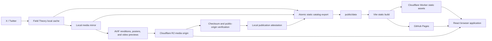

# System Architecture Guide for LLMs

This is the canonical, implementation-oriented map of the Twitter Bookmarks
system. Read `CONTEXT.md` first for the domain vocabulary, then use this guide
to understand how the repository, local data, media archive, exported catalog,
browser runtime, and deployments fit together.

The system is deliberately backend-free at runtime. All expensive and
privileged work happens during a local refresh. Production serves immutable
media plus a versioned static application and static JSON artifacts.

## System at a Glance



The production application URL is
`https://bookmarks.corychainsman.com`. The public media origin is
`https://tbmedia.corychainsman.com`. GitHub Pages is a second static
deployment with the `/twitter-bookmarks/` base path.

## Trust and Storage Boundaries

| Location | Role | Git status | Runtime visibility |
| --- | --- | --- | --- |
| `.data/fieldtheory/` | Raw Field Theory/X cache | Ignored | Private/local only |
| `.data/media/assets/` | Local media archive and generated media | Ignored | Uploaded to R2 |
| `.data/media/mirror-manifest.json` | Local source-of-truth media catalog | Ignored | Used during publication/export |
| `.data/media/r2-publication.json` | Attestation for one verified manifest digest | Ignored | Gates export |
| `public/data/` | Derived application catalog and embeddings | Committed | Shipped publicly |
| `dist/` | Built application | Ignored | Deployed publicly |
| R2 `twitter-bookmarks` | Serving archive | External | Public through media custom domain |
| Google Drive backup | Cold copy of originals/catalog data | External | Private backup |

Never commit `.data`. Treat `public/data` as generated, public output rather
than hand-authored source.

## Domain Model

The shared contracts live in `src/features/bookmarks/model.ts`.

- `TweetDoc` is one normalized bookmark. It owns text, author data, dates,
  folders, engagement metadata, and an ordered `media` array.
- `MediaItem` is one photo, video, or animated GIF attached to a `TweetDoc`.
  It contains the concrete original/playback URL and, when published, an
  explicit image or poster rendition catalog.
- `GridItem` is the flattened media-level projection rendered in the grid.
  Its stable identity is `gridId = tweetId:mediaIndex`.
- `Manifest` is the commit point for a static catalog generation. It names all
  JSON artifacts, counts records, carries `buildId`, and identifies the
  verified media catalog with `mediaCatalogVersion` and
  `mediaCatalogGeneration`.
- `QueryState` is the shareable UI state. Search, sort, direction, one/all
  media mode, immersive mode, motion preference, similarity target, zoom, and
  random seed round-trip through the URL.
- `BookmarksQuery` is the smaller worker-facing projection of `QueryState`.

The app exports only bookmarks with media. One-mode selects one representative
item per tweet; all-mode exposes every media item.

## Local Refresh and Publication Pipeline

The ordered pipeline is defined in `scripts/refresh-pipeline.ts` and invoked
through `scripts/refresh.ts` or the `package.json` commands.

```text
sync:ft
  -> data:mirror
  -> data:backfill-image-variants
  -> data:video-previews
  -> mirror:sync
  -> data:export
  -> data:embeddings
  -> data:validate
  -> build
```

Do not reorder these steps. In particular, export is forbidden until the
current media manifest has been uploaded and verified.

### 1. Field Theory sync

`scripts/sync-fieldtheory.ts` uses a real local X session and writes raw data
under `.data/fieldtheory`. Credentials are the X `ct0` and `auth_token`
cookies, managed through the X-auth scripts and 1Password. Authentication and
recovery details belong in `docs/runbooks/data-refresh.md`; do not duplicate
or expose credentials in application code or committed docs.

### 2. Media mirroring

`scripts/mirror-media.ts` reads Field Theory records, discovers `pbs.twimg.com`
and `video.twimg.com` URLs, downloads missing originals, and records each
attempt in `.data/media/mirror-manifest.json`.

Image originals are content-addressed by SHA-256:

```text
pbs/<source-stem>/objects/<original-sha256>.<extension>
```

Videos retain source-derived archive keys. New video records include a digest,
but the existing video archive has not been migrated to content-addressed
object paths.

Permanent upstream failures are recorded as `failed`. Successful records are
`ok` and carry byte size, MIME type, dimensions, digest when known, generated
variants, and preview/playback keys when applicable.

### 3. Image renditions

`scripts/image-renditions.ts` uses Sharp to rotate according to source
orientation, generates AVIF at quality 60/effort 2, and calculates a ThumbHash.
The width ladder is centralized in `scripts/mirror-lib.ts`:

```text
320, 680, 1280, 2048
```

The ladder is capped at the oriented source width. The catalog records actual
output width, height, bytes, MIME type, and SHA-256; it never advertises a
requested width that Sharp did not produce. Rendition keys include their
output digest:

```text
<original-stem>/renditions/v2/w<width>-<rendition-sha256>.avif
```

`scripts/backfill-image-variants.ts` migrates or repairs existing image
records. It is idempotent and part of the normal refresh sequence so the
manifest is always on the current rendition version.

### 4. Video assets

`scripts/generate-video-previews.ts` creates small, muted grid previews with
ffmpeg. They are 480px-wide H.264 MP4s, CRF 31, audio-free, fast-started, and
capped at eight seconds. The grid loops these clips; the lightbox uses the
full playback URL.

Video preview and playback paths are derived from the archived video stem.
They are immutable in normal operation. Re-encoding an existing path requires
a Cloudflare cache purge or a new versioned key.

### 5. R2 sync and publication attestation

`scripts/sync-mirror.sh` performs an append-only `rclone copy` to the R2
bucket, sets one-year immutable cache headers, and then runs two gates:

1. `rclone check --one-way` compares the local archive with R2 using hashes.
2. `scripts/media-publication.ts` sends `HEAD` requests through the public
   media origin for every manifest-referenced original, rendition, preview,
   and playback object. It validates status, byte length, and MIME type.

Digest-bearing URLs receive `?v=<digest>`. This isolates publication from a
negative CDN cache entry accidentally created before an immutable object was
uploaded.

Only after all public-origin checks pass does the script atomically write
`.data/media/r2-publication.json`. That file contains the SHA-256 of the exact
mirror manifest, media base URL, object count, and verification time.

Google Drive is a cold backup of originals, the manifest, and exported data.
The current script runs it after the R2 publication gate. It is not the serving
origin, but the refresh preflight currently requires both `r2:` and `gdrive:`
rclone remotes.

### 6. Atomic catalog export

`scripts/export-fieldtheory.ts` calls
`assertVerifiedMediaPublication` before writing any public catalog. Export
fails if the attestation is missing, the mirror manifest has changed since
verification, or the media base URL differs.

`scripts/mirror-rewrite.ts` replaces upstream media URLs with concrete R2
originals and attaches the explicit rendition metadata. It does not derive v2
rendition URLs from naming conventions at runtime. A concrete mirrored
original is the only fallback for a published item.

`scripts/export-lib.ts` writes a complete sibling staging directory, writes
`manifest.json` last, and then swaps the directory into `public/data`. If the
swap fails, the previous generation is restored. The manifest is therefore
the catalog commit point; a generation must never name partially written
artifacts.

Important exported files include:

- `grid/first.json`: small default-view first-paint slice.
- `grid/all.json`: every flattened media item.
- `grid/one.json`: representative item per tweet.
- `tweets/docs-*.json`: chunked `TweetDoc` records.
- `order/*.json`: bookmarked and posted orderings.
- `search/*`: lexical search artifacts.
- `embeddings/index.json`: normalized CLIP vectors.
- `manifest.json`: filenames, counts, build ID, media origin, and media
  catalog generation.

### 7. Embeddings, validation, and build

`scripts/export-embeddings.ts` uses CLIP to generate text and visual vectors.
Video and animated-GIF records are represented by their poster/preview image,
not temporal motion. The browser uses the same CLIP model family for query
vectors.

`scripts/validate-export.ts` verifies cross-file counts and references. For
media catalog v2 it also requires a catalog generation, exact rendition
metadata, digest-bearing URLs, and zero runtime `twimg.com` URLs.

Vite copies `public/data` into `dist` and code-splits the desktop masonry,
lightbox, Theme Studio, query worker, and embedding worker.

## Browser Runtime

### Routing and startup

`src/app/AppRouter.tsx` implements two static client routes:

- `/` is the bookmark browser.
- `/themes` is Theme Studio.

Cloudflare uses SPA fallback from `wrangler.jsonc`. GitHub Pages builds with
`GITHUB_PAGES=true`, which changes the Vite base path to
`/twitter-bookmarks/`.

`useBookmarksPageController` owns artifact hydration, URL state, query worker
coordination, semantic-query coordination, responsive column count, selected
lightbox item, and scroll-anchor restoration.

### Progressive artifact loading

`src/features/bookmarks/data-loader.ts` always revalidates
`data/manifest.json`. The `buildId` versions all artifact URLs and keys the
IndexedDB stores.

On a cold default-view load:

1. Fetch the manifest.
2. Fetch `grid/first.json` and render it.
3. Wait one paint.
4. Fetch the full grid and order files in parallel.
5. Stream the `TweetDoc` chunks independently.
6. Persist the complete generation in IndexedDB as a best-effort optimization.

Search and embedding artifacts load only when a feature needs them. IndexedDB
has separate stores for core, search, and embedding artifacts.

### Query execution

`src/workers/query.worker.ts` is the normal query seam. It is hydrated in
stages: core grid/order artifacts first, `TweetDoc` chunks later, and
embeddings on demand. It runs the pure query implementation in
`src/features/bookmarks/query-engine.ts`.

If the query worker is unavailable or exceeds its watchdog, the controller
falls back to the same query implementation on the main thread. Text input is
debounced before committing to query state.

`src/workers/embedding.worker.ts` lazily loads quantized CLIP text or vision
encoders. Text search embeds three prompts and averages their normalized
vectors; uploaded-image search uses the vision encoder. Similar-media search
uses the precomputed vector for the selected `GridItem`.

### Grid implementations

`src/components/grid/BookmarksGrid.tsx` chooses the implementation at module
load based on the user agent:

- Desktop and non-iOS browsers lazy-load `BookmarksMasonry.tsx`, which uses
  `react-virtualized` Masonry and WindowScroller with estimated measurement,
  overscan, and scroll-anchor restoration.
- iOS WebKit avoids the desktop virtualization chunk. It renders a bounded
  CSS-column grid in batches of 80 and exposes a Load more button.

The first 12 or first four rows (whichever is larger on desktop) receive
initial image priority. Images use native browser lazy loading. Video sources
use geometric admission: iOS observes only motion tiles, while desktop derives
admission from the virtualized viewport and overscan range.

### Image delivery

`src/features/bookmarks/media-delivery.ts` is the single selection seam used
by the grid and lightbox.

- Published photos use their explicit catalog of AVIF candidates.
- The browser chooses a candidate from truthful width descriptors and the
  rendered CSS width/device pixel ratio.
- `<picture>` exposes AVIF while `` retains the mirrored original as a
  format/error fallback.
- ThumbHash renders a tiny placeholder under the media.
- Native `loading`, `srcset`, `sizes`, decoding, browser cache, and CDN cache
  own image scheduling. Do not reintroduce JS image source detachment or a
  parallel image preloader without measuring a concrete regression.
- A mirrored URL must never fall back to `pbs.twimg.com`. If the explicit
  catalog is absent, use the concrete mirrored original.

### Video delivery and autoplay

`GridVideoPreview` in `src/components/media/GridVideoPreview.tsx` owns the
complete preview lifecycle behind one interface: one-way source admission,
viewport eligibility, page visibility, bounded pause recovery, and looping.
`src/components/media/autoplay.ts` centralizes the policy: start at 10% tile
visibility and continue until the tile reaches 0%. This hysteresis avoids
play/pause churn at the entry threshold.

Deferred previews attach neither `src` nor `poster`. Once admitted, a preview
keeps its source for the lifetime of that mounted tile, so changing scroll
priority cannot reset `currentTime`. Hidden react-virtualized measurement
cells never create playback observers. A single shared page-visibility Module
notifies grid and lightbox playback; opening the lightbox disables grid
playback so covered previews do not continue decoding underneath it.

The lightbox plays and loops the full-resolution URL with native controls. It
transfers the grid video's current playback time when possible and preserves
page-hide/page-show intent. Open and close use a same-document View Transition
when supported, pairing only the selected grid media with the lightbox media;
reduced-motion and unsupported browsers fall back to an immediate state
change.

## Deployment

There are two static deployments:

### Cloudflare Worker static assets

`wrangler.jsonc` points at `dist`, enables SPA fallback, and binds the custom
domain. Deploy manually with:

```bash
bun run deploy:cf
```

This runs a root-base Vite build and `wrangler deploy`. It requires a valid
Cloudflare session/environment.

### GitHub Pages

`.github/workflows/deploy.yml` runs on pushes to `main`, builds with
`GITHUB_PAGES=true`, and publishes `dist` to GitHub Pages. It is a secondary
deployment and does not publish the R2 media archive.

Pushing source or `public/data` is not sufficient to update the Cloudflare
custom domain; `bun run deploy:cf` is a separate operation.

## Ownership and Edit Map

| Concern | Primary files |
| --- | --- |
| App routing/shell | `src/app/`, `src/main.tsx` |
| Bookmark controller | `src/app/bookmarks/useBookmarksPageController.ts` |
| Shared data contracts | `src/features/bookmarks/model.ts` |
| Artifact loading/cache | `data-loader.ts`, `idb-cache.ts`, `export-artifacts.ts` |
| URL/session state | `url-state.ts`, `location-state.ts`, `session-state.ts` |
| Query semantics | `query-request.ts`, `query-engine.ts`, `query.worker.ts` |
| Semantic inference | `embedding*.ts`, `embedding.worker.ts`, `export-embeddings.ts` |
| Grid/layout | `src/components/grid/` |
| Media rendering | `MediaTile.tsx`, `media-delivery.ts`, `twitter-media-url.ts` |
| Lightbox | `src/components/lightbox/` |
| Theme system | `src/features/theme/`, `ThemeStudio.tsx` |
| Field Theory/X sync | `scripts/fieldtheory.ts`, `sync-fieldtheory.ts`, X-auth scripts |
| Media archive | `mirror-media.ts`, `mirror-lib.ts`, `image-renditions.ts` |
| R2 publication gate | `sync-mirror.sh`, `media-publication.ts` |
| Static export | `export-fieldtheory.ts`, `mirror-rewrite.ts`, `export-lib.ts` |
| Export validation | `validate-export.ts` |
| Deployments | `vite.config.ts`, `wrangler.jsonc`, `.github/workflows/deploy.yml` |

Paths without a directory in this table are under
`src/features/bookmarks/` or `scripts/` according to their concern.

## Invariants for Future Agents

1. Never expose or commit raw Field Theory data, browser cookies, R2 secrets,
   or 1Password output.
2. Never export a mirror generation that lacks a matching verified R2
   publication attestation.
3. Never write a public manifest before every artifact it names exists.
4. Never advertise guessed rendition dimensions or convention-derived v2
   paths. Consume the explicit catalog.
5. Never route a published mirrored item back to `twimg.com` as a fallback.
6. Treat content-addressed image paths as immutable. A byte change means a new
   digest and URL.
7. Preserve `gridId = tweetId:mediaIndex` as the cross-artifact and URL
   identity.
8. Keep shareable query/display behavior URL-backed.
9. Keep expensive search/inference off the interaction-critical main thread,
   while preserving the tested main-thread query fallback.
10. Treat `public/data` changes as generated catalog changes and report them
    explicitly in reviews.
11. Do not run refresh/export commands unless the user requested data changes.
12. Validate the narrow module first; before publication run tests,
    typecheck, lint, build, and the appropriate export/media gates.

## How an LLM Should Approach Changes

1. Read `AGENTS.md`, `CONTEXT.md`, this guide, and the applicable runbook.
2. Inspect the nearest implementation and colocated tests before editing.
3. Decide which boundary is changing: local source data, mirror manifest,
   publication gate, public catalog, runtime selection, or deployment.
4. Preserve the invariants above and avoid coupling two boundaries through an
   inferred naming convention.
5. Add or update the nearest tests. Pipeline order, publication gating,
   catalog contracts, URL round-tripping, media fallback, and responsive grid
   behavior all have dedicated test modules.
6. Use the smallest validation ladder that proves the change, then run the
   full relevant checks before pushing.
7. Update this guide only when a durable architecture, workflow, invariant,
   or known system limitation changes.

For operational commands and credentials setup, use
`docs/runbooks/data-refresh.md` and `docs/runbooks/media-mirror.md`. For normal
coding changes, use `docs/runbooks/coding-workflow.md`.
