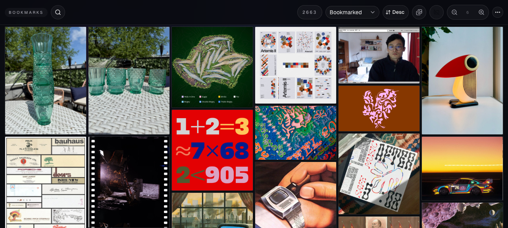
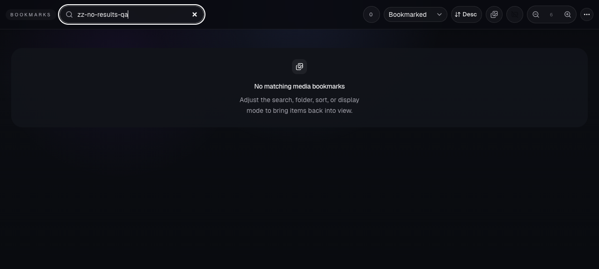
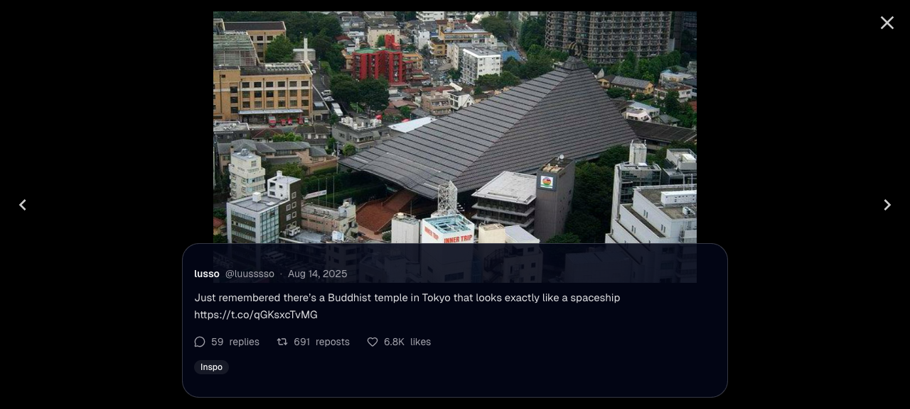
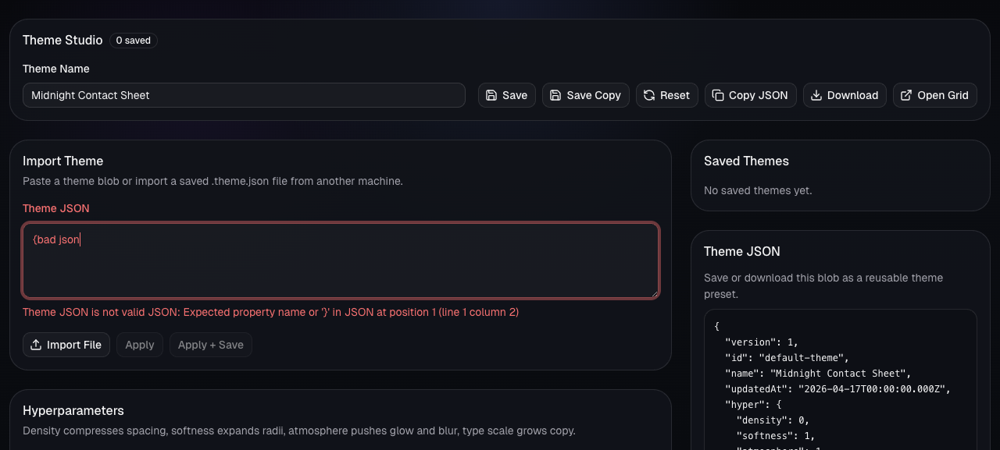
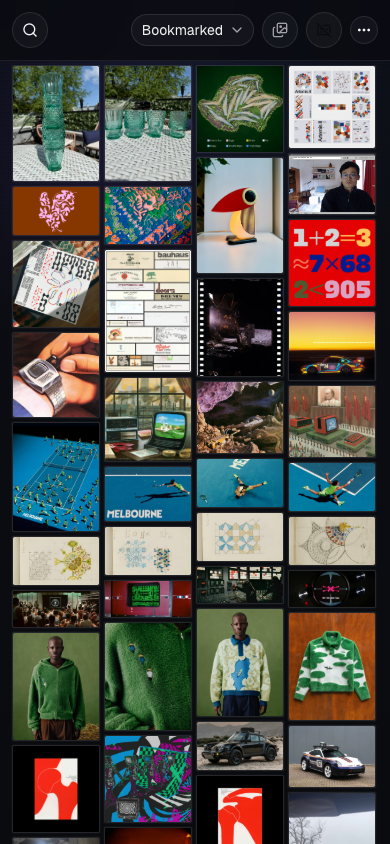
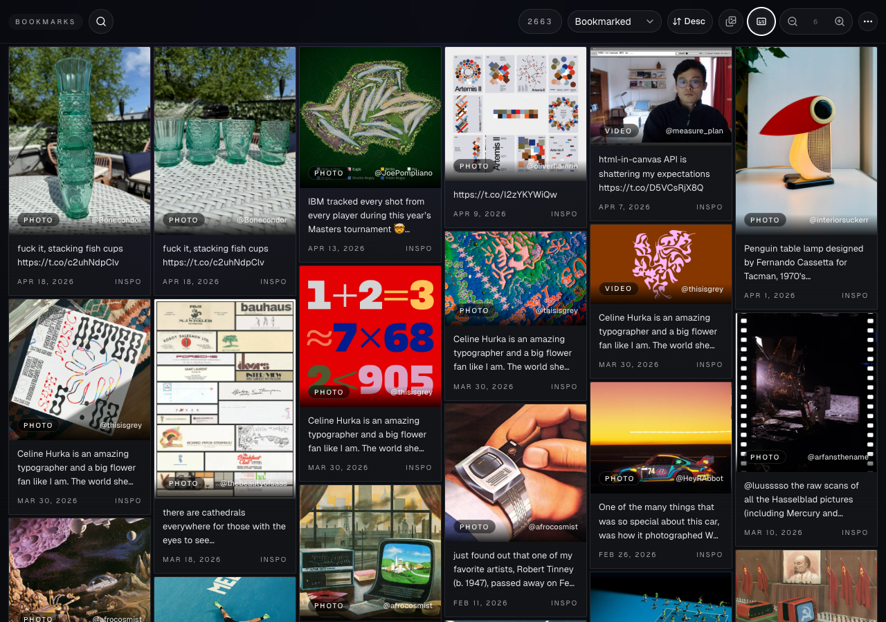

# Dogfood Report: Twitter Bookmarks Media Browser

| Field | Value |
|-------|-------|
| **Date** | 2026-04-25 |
| **App URL** | http://127.0.0.1:5173/ |
| **Session** | twitter-bookmarks-codex-pass2 |
| **Scope** | Black-box pass over grid search/filtering, lightbox, Theme Studio import validation, caption toggle, and mobile layout. |

## Summary

| Severity | Count |
|----------|-------|
| Critical | 0 |
| High | 0 |
| Medium | 1 |
| Low | 0 |
| **Total** | **1** |

## Issues

### ISSUE-001: Search-filtered grid emits duplicate React key warnings

| Field | Value |
|-------|-------|
| **Severity** | medium |
| **Category** | console |
| **URL** | http://127.0.0.1:5173/ |
| **Repro Video** | N/A |
| **Status** | Fixed |

**Description**

After filtering the grid to `spaceship` and opening a matching item, the browser console fills with React duplicate-key warnings. Expected: filtering and opening media should not emit React key warnings. Actual: the console reports repeated `Encountered two children with the same key` errors for masonry cells, which can lead to unstable rendering if React reuses the wrong child identity during layout changes.

**Repro Steps**

1. Navigate to the app.
   

2. Open search and enter a query that has no results; the empty state behaves correctly.
   

3. Replace the query with `spaceship`, then open a matching media item.
   

4. **Observe:** the console contains duplicate-key warnings for masonry render keys. Console evidence is saved at `console-after-duplicate-key.txt`.

**Fix Verification**

Re-ran the same `spaceship` search and lightbox-open flow after the masonry key fix. Console output was empty; evidence is saved at `console-after-fix.txt`.

---

## Additional Checks

- Theme Studio invalid JSON keeps Apply actions disabled and does not crash.
  
- Mobile grid at 390x844 remains usable with compact controls and a populated list.
  
- Caption toggle reveals metadata without breaking the masonry list.
  
