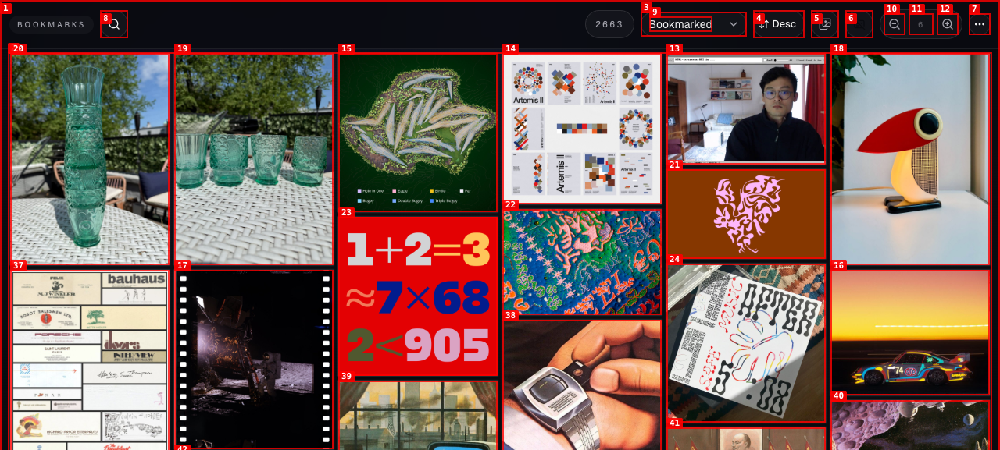
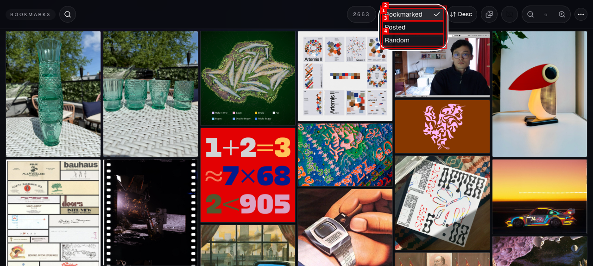
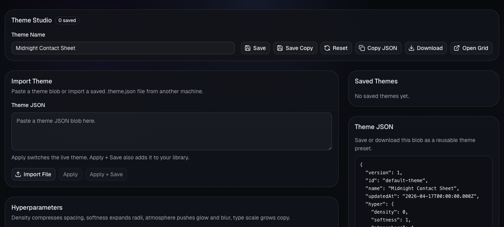
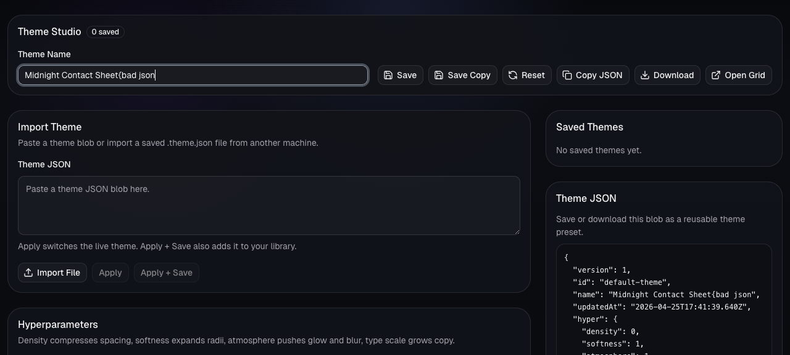
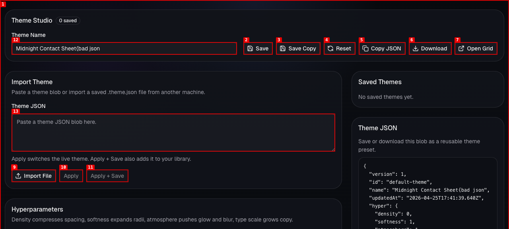

# Dogfood Report: Twitter Bookmarks Media Browser

| Field | Value |
|-------|-------|
| **Date** | 2026-04-25 |
| **App URL** | http://127.0.0.1:5173/ |
| **Session** | twitter-bookmarks-codex |
| **Scope** | Full local app: grid, lightbox, search, sort/filter controls, and Theme Studio |

## Summary

| Severity | Count |
|----------|-------|
| Critical | 0 |
| High | 0 |
| Medium | 2 |
| Low | 0 |
| **Total** | **2** |

## Issues

### ISSUE-001: Grid render logs duplicate React key errors

| Field | Value |
|-------|-------|
| **Severity** | medium |
| **Category** | console |
| **URL** | http://127.0.0.1:5173/ |
| **Repro Video** | N/A |

**Description**

The grid logs many React errors: `Encountered two children with the same key`. React warns that duplicate keys can cause children to be duplicated or omitted, so this is a rendering correctness risk for the core bookmark grid.

**Repro Steps**

1. Navigate to http://127.0.0.1:5173/.
   

2. Open the browser console for the grid page.
   

3. **Observe:** the console contains repeated duplicate-key errors for bookmark/media child keys such as `2041627336890552607:0`.

---

### ISSUE-002: Invalid Theme JSON can be applied with no visible feedback

| Field | Value |
|-------|-------|
| **Severity** | medium |
| **Category** | ux / functional |
| **URL** | Theme Studio opened from http://127.0.0.1:5173/ |
| **Repro Video** | videos/issue-003-repro-full.webm |

**Description**

Theme Studio enables `Apply` and `Apply + Save` as soon as any text is entered into the Theme JSON box, even when the text is invalid JSON. Clicking `Apply` with invalid JSON leaves the user on the same screen with no inline error, toast, or disabled state explaining what went wrong.

**Repro Steps**

1. Open Theme Studio from the grid's overflow menu.
   

2. Type `{bad json` into the Theme JSON field.
   

3. Click `Apply`.
   

4. **Observe:** the invalid payload remains, the action buttons remain enabled, and no visible error message explains the parse failure.

---
