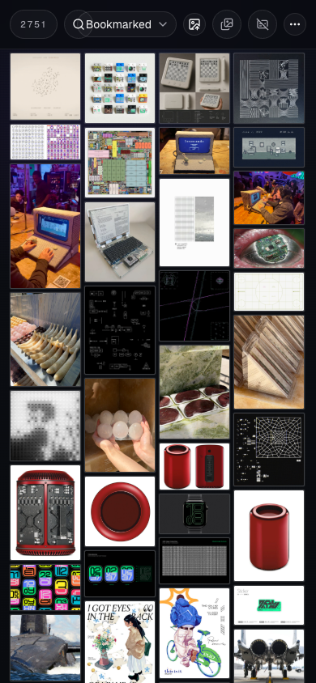
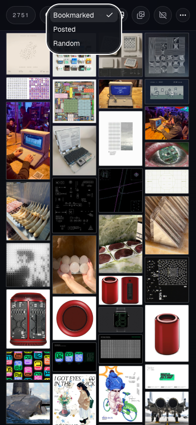
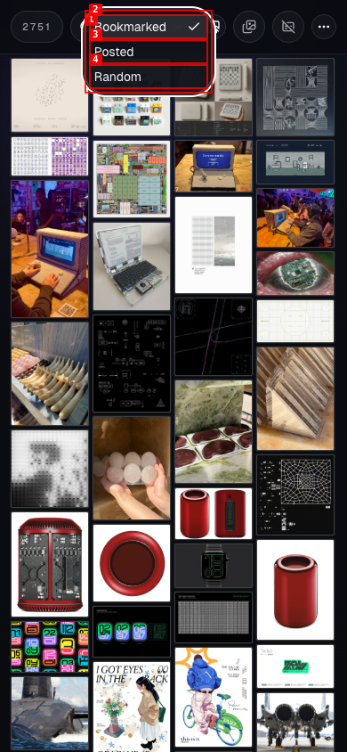
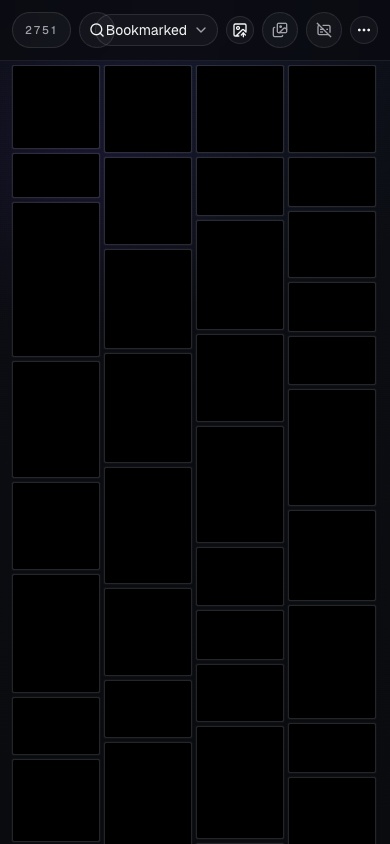
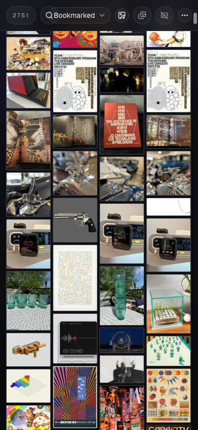
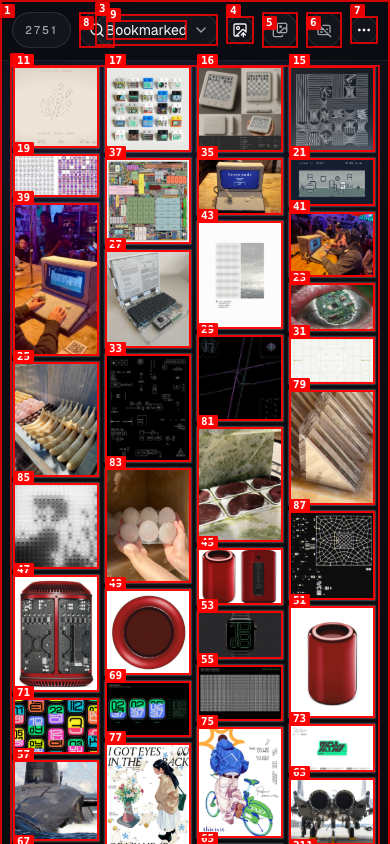

# Dogfood Report: Twitter Bookmarks Media Browser

| Field | Value |
|-------|-------|
| **Date** | 2026-04-29 |
| **App URL** | http://127.0.0.1:5173/ |
| **Session** | twitter-bookmarks-mobile-touch |
| **Scope** | Mobile touchscreen interactions, iOS Safari scroll/momentum/swipe/reload edge cases |

## Summary

| Severity | Count |
|----------|-------|
| Critical | 0 |
| High | 0 |
| Medium | 2 |
| Low | 0 |
| **Total** | **2** |

## Issues

### ISSUE-001: Search icon opens the sort dropdown on mobile

| Field | Value |
|-------|-------|
| **Severity** | medium |
| **Category** | functional / ux |
| **URL** | http://127.0.0.1:5173/ |
| **Repro Video** | videos/issue-001-repro-2.webm |

**Description**

On a 390px-wide mobile viewport, tapping the visible search icon opens the sort dropdown instead of expanding the search field. The search affordance appears between the result count and sort control, but its tap target overlaps or is obscured by the adjacent sort trigger. Expected: tapping the search icon should reveal the search input. Actual: the sort listbox opens with Bookmarked / Posted / Random options.

**Repro Steps**

1. Navigate to http://127.0.0.1:5173/ with a 390px-wide mobile viewport. The search icon is visible between the count and the sort dropdown.
   

2. Tap the center of the search icon.
   

3. **Observe:** the sort dropdown opens instead of the search input.
   

---

### ISSUE-002: Reload loses the current grid position on mobile

| Field | Value |
|-------|-------|
| **Severity** | medium |
| **Category** | ux / functional |
| **URL** | http://127.0.0.1:5173/ |
| **Repro Video** | videos/issue-002-repro.webm |

**Description**

After scrolling down the media grid in a 390px-wide mobile viewport, reloading the page returns the user to the top of the grid. For a large masonry browser, this loses the user's browsing context and is especially painful on mobile where reloads can happen accidentally through browser gestures. Expected: the app should restore the previous grid position after reload. Actual: the page returns to the first items.

**Repro Steps**

1. Navigate to http://127.0.0.1:5173/ with a 390px-wide mobile viewport.
   

2. Scroll down in the media grid.
   

3. Reload the page.
   

4. **Observe:** the grid is back at the top instead of the scrolled position.

---
